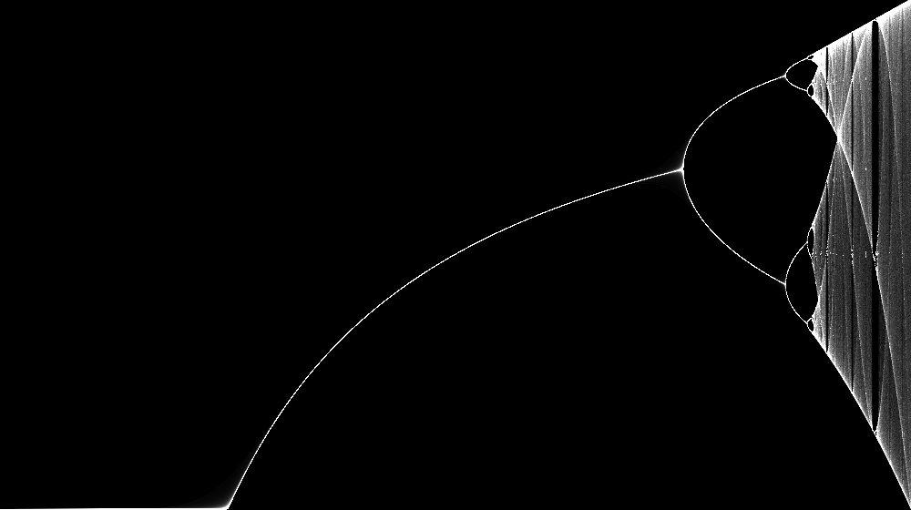

# FREC Creative Submission!

Tasked with creating a creative work that describes the impact that O-Week has had on us, I decided to go with an implementation of chaos theory, something that goes by many names, but most notably 'The Logistic Map'.

## The Logistic Map

This equation was first used to model the populations of a species under varying growth rates, and has since been shown to appear in many other areas of mathmatics such as the mandelbrot set, or the motion of fluids during convection

The fundamental equation used to calculate this is an "example of how complex, chaotic behaviour can arise from very simple nonlinear dynamical equations", and is given by:

$$x_{n+1} = rx_n(1-x_n)$$

Where:

$`x_n`$ is the current population and is in the set $`\{x_n \in \mathbb{Q} | 0 \lt x \lt 1 \}`$

The parameter $r$ here refers to the growth rate of the population. $`r > 4`$ will create $`x_n+1`$'s that lie outside of our desired range for $`x_n`$, so only values $`0 < r < 4`$ are considered.

$`x_{n+1}`$ is the calculated population of the next generation

if this equation is plotted with $r$ on the x axis and $x_n$ plotted as the y axis, as this equation is iterated, the logistic map will be formed.

### Learn More!:
* [A Video by Veritasium](https://www.youtube.com/watch?v=ovJcsL7vyrk)
* [Wikipedia](https://en.wikipedia.org/wiki/Logistic_map)

## Python Implementations

### First Implementation

[Code for this version](Logistic_1.py)

A simple implentation of this was rather easy to construct. All it required was looping through every x value in the image to be generated, iterating the logistic function several times (skipping the first few iterations to allow the patterns to converge), then changing that calculated pixel from 0 to 1.

### "Anti-Aliased" Implementation

[Code for this version](Anti-aliased_Logistic.py)

This implementation is very similar to the previous, however instead of simply changing the pixel from 0 to 1, the brightness is increment by 1/255 (its a binary thing). This was implemented to allow for a lower resolution image to capture the intricacies of the fractal

### The Interactable Version

[Code for this version](Logistic_Tkinter.py)

After the creation of the Anti-aliased version I wanted to create something that would not only allow myself to explore this fractal in more depth, but to also allow others to see the beauty of this equation. This was a pain in the ass to implement, but I was ultimately able to get this working somewhat reliably. While on the surface this may look lower resolution, but by zooming in, you can get much higher detail than the other implementations

Feel free to run the code yourself, it requires installing the tkinter library in python. left click zooms in, right click zooms out. Please be mindful that a LOT of calculations have to be run every time you click, so please be patient as it calculates and renders the next image.

The code is commented, but there were a few lines I wrote while sleep deprived, and so I have no idea why they work.
#### Tricolor version
this functions exactly the same but the points are colored in the queens tricolor

